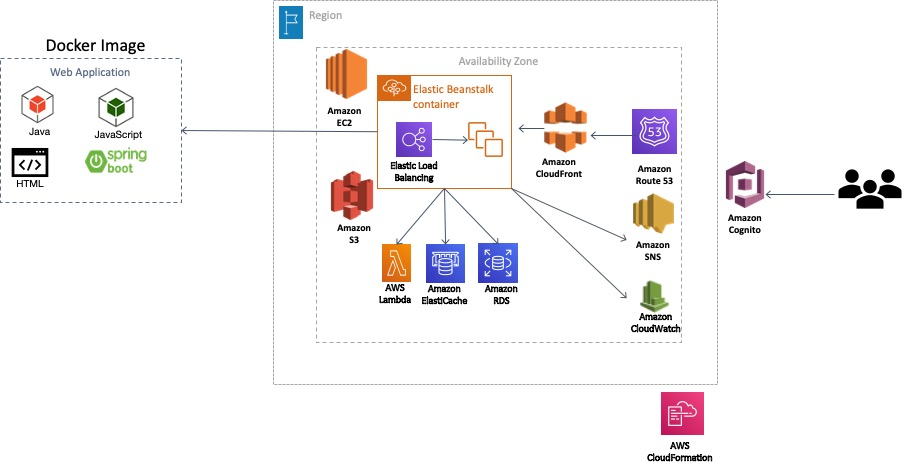

#### Technologies needed to run the project – 
* Java -15, Gradle
* AWS account access
* Docker account
* AWS CLI and Docker CLI
* AWS Certificate Manager – generate certificate for domain proj1.parvathipai.com and associate with application load balancer in Beanstalk for SSL/TLS termination
* AWS Route 53 – hosted zone for parvathipai.com and ALIAS record for proj1.parvathipai.com
* AWS Cognito – user pool for users and admins logging into and registering to access the website and also for 1) validating security requirements including – password strength, standard attributes required for registration, account recovery and 2) registering an appclient for OAuth 2 authentication in Spring Security
* AWS RDS – for a micro free tier MySQL instance that hosts the database that the Spring application interacts with and records the logs of file uploads, etc.
* AWS S3 hosts a bucket that is partitioned by username to ensure users cannot access each other’s uploads for modification or deletion
* AWS IAM configures users who can deploy the Spring application
* AWS EC2 Load Balancer is the SSL termination for requests and routes to 2 instances of the application via Beanstalk.
* AWS EC2 hosts the Spring application via a webserver listening on 80 (HTTP) and 443 (HTTPS) and connects the aforementioned services
* Spring application uses Spring Security,Spring-Starter-web, Thymeleaf, OAuth2, JPA etc. and is deployed via a Docker container in 3 environments – local development via Intellij IDEA, local deployment via beanstalk, and prod deployment via Beanstalk – with corresponding environment variables
* Spring application exposes a Thymeleaf page for uploading files and APIs for interacting with the application
* AWS VPC configures a bridge security group that connects to both the Beanstalk application and the RDS instance allowing only 3306 (MySQL) incoming traffic to go through.
* AWS CloudFormation templates to create the S3 bucket and Cloud Front
* AWS lambda, Cloud watch and AWS SNS to notify when a file is deleted in S3.

#### Architecture of the project

